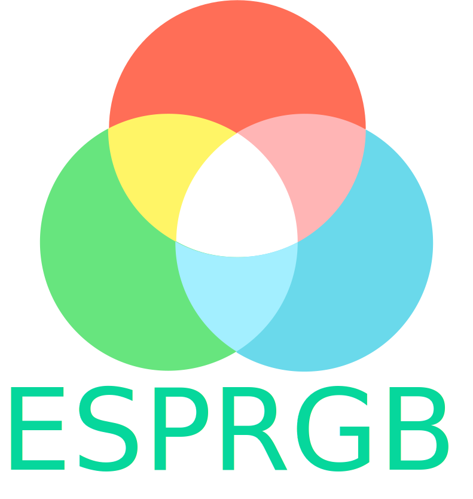

# ESPRGB-8266

  

&nbsp;&nbsp;&nbsp;&nbsp;&nbsp;&nbsp; **ESPRGB** is a open-source platform that provides you with the easiest way to upgrade your rgb led strip to a fully-featured and customizable wifi rgb controller for cheap.

&nbsp;&nbsp;&nbsp;&nbsp;&nbsp;&nbsp; This should be the easiest way to make a diy rgb controller and finally get rid of all the cheap remotes.
Using a esp8266 board, some mosfets a linear regulator (or buck converter) using the power of ESPRGB to your advantage to have a seamless experience using your led strips.

ESPRGB uses a combination of HTTP and WebSockets to communicate between your PC (or phone) with the lowest latency.

**ESPRGB is promising:**
  - the ease of getting started
  - wifi controlled rgb strip
  - a strong integration with your computer
  - the ease to expand to more ESPRGB controllers
  - a way to sync all your controllers to play animations like a single unit
  - and being a fully open-source project
  
You can find a video version here: [youtube](https://www.youtube.com/watch?v=K69-Y2wl2bE&list=PLpYguLWjYcdbfyVIKRt1rsTTXNF7Dq1y1&index=2)

If you want to contact me or have any question you can at: **limiteddata90@gmail.com**

If you've found a bug you can report it at: [issues](https://github.com/limiteddata/ESPRGB-8266/issues)

And also the road map of the project is here: [road map](https://github.com/limiteddata/ESPRGB-8266/projects/1)

The windows client is here: [ESPRGB-Client](https://github.com/limiteddata/ESPRGB-Client/)

If you're having problems scroll down to the debug section.

With that said let's get started!

**Installation:**

  1. Hardware
  2. Software

# 1. Hardware

&nbsp;&nbsp;&nbsp;&nbsp;&nbsp;&nbsp; The hardware should be pretty simple and straightforward and easy to understand.
We are using pwm to control 3 mosfet to dim each led with a external power supply (12 v) and also step down the 12v to 5v (or 3.3v depending on the board used) for the esp.

Hardware needed:
  -  1 esp8266
  -  3 mosfets (IRF3205 , IRF510 or other n type mosfet)
  -  3 1k-10k ohm resistors (you might get away without)
  -  1 buzzer (optional)
  -  1 linear regulator or buck converter (5v or 3.3 depending on the board used)
  -  1 power jack connector
  -  1 rgb led strip connector
  -  1 12v power supply

**Note** I recommend using a buck converter instead of the voltage regulator because it will get pretty hot and also if you are not using any capacitor you'll probably get weird reboots.

The mosfet Source (right pin), esp and power source needs to be connected together to ground.
The mosfet Gate (left pin) needs to be connected with a resistor (you might get away without) to a pin of the esp. And the mosfet Drain (middle pin) to each colored wire of the led connector.
The Black wire of the connector needs to be connected to positive 12v of the power jack.
And the buck converter or linear will take ground and positive of the 12v power source and you'll connect it to your 5v (or 3.3v depending on the board used).

**Note:** This firmware is compatible with most of the esp8266 boards (tested with a generic esp8266-12f and a wemos d1 mini). I'll further add support to ESP32's.

Available pins : 0 1 2 3 4 5 12 13 14 15 , pin 16 is set by default as a hard reset button

Recommend pins : 5 4 14

Here are two example of schematics that show you how to connect everything together, one using a wemos d1 mini (easier to create on a breadboard) and a version using a esp12f that will end up smaller in size because it doesn't include a serial converter.

**Controller using a Wemos d1 mini**

  

**Controller using a standalone esp12f**

  

**Note** That if you are using the standalone version you'll need to upload the firmware using a FTDI serial converter as shown in this schematic for the first time and then after you initialize the device you'll be able to upload the firmware over the air using Arduino OTA using the port esprgb_name.

  

# 2. Software:

  If you're sure that the wiring is done proper uploading the firmware it will be easy.
  The firmware doesn't need any modification to be done, no programming skills are required, just connect the board and hit upload.

  Steps:
  1. Installing the firmware to the esp
  2. Initialize device
  3. Get started with the client

# 1. Installing the firmware to the esp

  This firmware is created using platformio and if you are familiar with this platform uploading the firmware will take little to no time, no library needed to be installed, just open the project and press upload. To install platformio to Visual Code follow this: https://platformio.org/install/ide?install=vscode

  

    
  

  If you need to change the upload port open the platformio.ini file and change the upload_port.

  

    
  

  If you are more familiar with arduino ide you can find the firmware under ./esprgb-8266-ide but you'll need to install all the required libraries from libraries.txt

  After upload the built in blue led will stay opened, that's how you know everything is fine.

# 2. Initialize device

  The solid blue built in led means that the device is initialize mode and so it creates a access point (hotspot) named ESPRGB_Config(XX:XX:XX). Connect to the device with your phone or laptop and then go to 192.168.1.1 with a browser.

  Now you'll need to initialize(configure) your esp

  

    
  

  * First you need to add your wifi credentials. To make it easy for you to write your ssid and password the esp does a scan of all the wifi's nearby.

  * Next you need to set a name to your esp. This is the final name **esprgb-name** and it will also be used as the hostname( http://esprgb-name.local/ )

  * Next you need to configure your pinout. Select a pin and then the button **TEST** to check if it's the right pin. If you don't have a buzzer installed just leave it at 0.

  * You can set a static ipaddress if you are planning to use your device from your phone because android doesn't support mdns.

  * Done.

  After you send the config the esp will go through a checking sequence where the built in led will flash 4 times and will turn on each pin R,G,B and then the buzzer (if you see that one or more of the led doesn't turn on you have a problem).
  After that it will restart and try to connect to your credentials. Here the esp will slowly flash (~12 flashes). If it can't connect with the specified credentials (for around 1:30 min) the esp will not save the config and go back in initialization (or to the last successful config).

  Now the led strip should have a solid red color meaning that everything is perfect.

# 3. Get started with the client

  ESPRGB provides two clients that look the same but are slightly different:

  * Web version which you can access right away by opening your browser and go to http://esprgb-name.local/ (or the ipaddress). This version of the client is built into the esp and can be used from any device that has a browser, but it has less features.

  

    
  

  * Windows only client that can do audio reactive led without using a microphone, ambilight, create schedules so that when you open a app the lights are set accordingly and also sync all your devices to play animations as a single unit. This client if it's setup right can open and close the lights when whenever your pc is running. This client and more information is available at : [ESPRGB-Client](https://github.com/limiteddata/ESPRGB-Client)

  

    
  

In my opinion I'd go with the windows client only because it can turn off the lights when I shutdown my pc, but also for the tight integration with your pc.

# Debug

If you have issues with the config ( changed the wifi credentials of your router ) you can do a hard reset by adding a button to D0 (pin 16) or simply run a wire from the pin to 3.3v (HIGH) and reset the board. After 10 seconds when the board start to rapidly flash you can release the button (gnd low). Now your board will remove the config file and go back to a uninitialized
device.

If you are having weird reboots is probably due to improper power to the esp, if you've used a linear regulator use capacitors between the input and the output or use a buck converter.

If one or more leds don't turn on check the wiring especially the grounds, all the grounds need to be connected together, try to connect the mosfets without a resistor or check the continuity between the connection.

If none the above worked for you email me at **limiteddata90@gmail.com**

**Built in led flashing codes:**

**Solid Blue** - the board it's in initialization stage

**Flashing slowly** -  the board is trying to connect to your router

**Flashing rapidly** - the board is doing a hard reset (removes the config file)

After sending the config the board will flash 4 times. Each flash of the board will result in a pin being tested. After that it will try to connect to the router and start flashing slowly.

If none the above worked for you email me at **limiteddata90@gmail.com**

Thank you for trying ESPRGB or at least taking a look at what I've done on this project.
